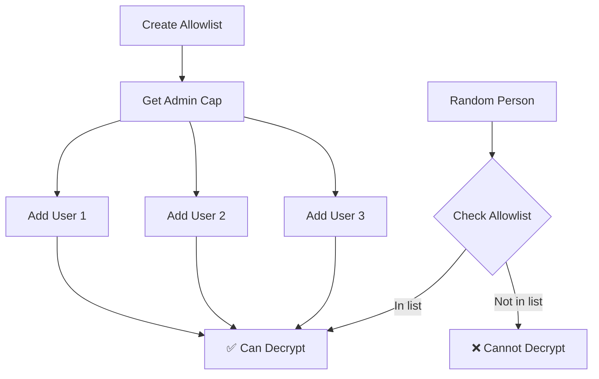
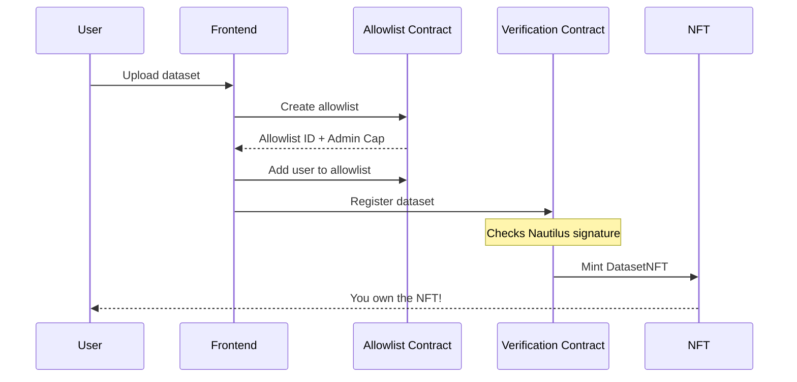

# TruthMarket Smart Contracts

**Move contracts for dataset verification on Sui blockchain**

This folder contains all the smart contracts (written in Move language) that power TruthMarket.

---

## What Are These Contracts?

Think of smart contracts as rules that run on the blockchain. Once deployed, nobody can change them - they work exactly as programmed forever.

---

## Our Contracts

### 1. **truthmarket-verification/** - Main Contract

**What it does:** Records dataset registrations on the blockchain

**Key features:**
- Creates Dataset NFTs when you register
- Stores hash of your original file
- Records when the dataset was registered
- Tracks where the encrypted file is stored
- Verifies Nautilus attestation signatures

**Main function:**
```move
public fun register_dataset_dev(
    name: vector<u8>,           // Dataset name (e.g., "my-dataset.csv")
    format: vector<u8>,          // File format (e.g., "CSV")
    size: u64,                   // File size in bytes
    original_hash: vector<u8>,   // SHA-256 hash of original file
    metadata_hash: vector<u8>,   // Hash of all metadata
    walrus_blob_id: String,      // Where file is stored on Walrus
    seal_policy_id: String,      // Seal encryption policy ID
    allowlist_id: Option<ID>,    // Who can access (optional)
    timestamp: u64,              // When registered
    enclave_signature: vector<u8>, // Nautilus proof
    enclave_config: &EnclaveConfig, // Nautilus public key
    ctx: &mut TxContext
): DatasetNFT
```

**What you get back:** A DatasetNFT object that proves your dataset is registered

### 2. **seal-allowlist/** - Access Control

**What it does:** Controls who can decrypt your datasets

**How it works:**



**Key functions:**

```move
// Create a new allowlist
public fun create_allowlist(name: String, ctx: &mut TxContext): Cap

// Add someone to the allowlist
public fun add(allowlist: &mut Allowlist, cap: &Cap, account: address)

// Remove someone
public fun remove(allowlist: &mut Allowlist, cap: &Cap, account: address)

// Check if someone can decrypt (called by Seal)
entry fun seal_approve(id: vector<u8>, allowlist: &Allowlist, ctx: &TxContext)
```

**Important:** The `Cap` object gives you admin powers - keep it safe!

### 3. **enclave/** - Nautilus Configuration

**What it does:** Stores the public key for Nautilus attestation verification

**Why we need it:** So the blockchain knows which Nautilus server is legit

---

## How They Work Together



---

## Deploying the Contracts

### Prerequisites

```bash
# Install Sui CLI
cargo install --locked --git https://github.com/MystenLabs/sui.git --branch mainnet sui

# Configure for testnet
sui client new-env --alias testnet --rpc https://fullnode.testnet.sui.io:443
sui client switch --env testnet

# Get testnet tokens
sui client faucet
```

### Deploy Step-by-Step

**1. Deploy Allowlist Contract First**

```bash
cd seal-allowlist

# Build to check for errors
sui move build

# Run tests
sui move test

# Deploy to testnet
sui client publish --gas-budget 100000000
```

**Important:** Copy the package ID from the output! It looks like:
```
Published Objects:
  Package ID: 0xabc123...
```

Save this as `SEAL_ALLOWLIST_PACKAGE_ID`

**2. Deploy Verification Contract**

```bash
cd ../truthmarket-verification

# Build
sui move build

# Deploy
sui client publish --gas-budget 100000000
```

Save the package ID as `VERIFICATION_PACKAGE`

Also note the `EnclaveConfig` object ID - you'll need this too!

**3. Update Frontend Config**

```bash
cd ../../truthmarket-frontend-v3

# Edit .env.local
nano .env.local
```

Add:
```env
NEXT_PUBLIC_VERIFICATION_PACKAGE=0xYourVerificationPackageID
NEXT_PUBLIC_ENCLAVE_ID=0xYourEnclaveConfigObjectID
NEXT_PUBLIC_SEAL_ALLOWLIST_PACKAGE_ID=0xYourAllowlistPackageID
```

---

## Understanding the Data Structures

### DatasetNFT (What you get when you register)

```move
public struct DatasetNFT has key, store {
    id: UID,                      // Unique ID
    name: vector<u8>,             // "my-dataset.csv"
    format: vector<u8>,           // "CSV"
    size: u64,                    // 1024000 (bytes)
    original_hash: vector<u8>,    // SHA-256 hash
    metadata_hash: vector<u8>,    // Hash of all metadata
    walrus_blob_id: String,       // Where file is on Walrus
    seal_policy_id: String,       // Seal encryption policy
    allowlist_id: Option<ID>,     // Access control (if any)
    timestamp: u64,               // Unix timestamp
    uploader: address,            // Who registered it
}
```

### Allowlist (Who can decrypt)

```move
public struct Allowlist has key {
    id: UID,                  // Unique ID
    name: String,             // "My Project Allowlist"
    list: vector<address>,    // [0xabc..., 0xdef..., 0x123...]
}
```

### Cap (Admin powers)

```move
public struct Cap has key {
    id: UID,              // Unique ID
    allowlist_id: ID,     // Which allowlist this controls
}
```

**Security Note:** Whoever holds the Cap can add/remove people from the allowlist!

---

## Common Operations

### Check if Dataset is Registered

```typescript
// In frontend
const nft = await suiClient.getObject({
  id: "0xYourNFTId",
  options: { showContent: true }
});

console.log(nft.content.fields);
// Shows: name, format, size, original_hash, etc.
```

### Search by Hash

```typescript
// Find dataset by its hash
const objects = await suiClient.queryObjects({
  filter: {
    StructType: `${VERIFICATION_PACKAGE}::truthmarket::DatasetNFT`
  }
});

// Check each one to find matching hash
for (const obj of objects.data) {
  const content = await suiClient.getObject({
    id: obj.objectId,
    options: { showContent: true }
  });

  if (content.data.content.fields.original_hash === targetHash) {
    console.log("Found it!", obj.objectId);
  }
}
```

### Add User to Allowlist

```typescript
const tx = new Transaction();

tx.moveCall({
  target: `${ALLOWLIST_PACKAGE}::allowlist::add`,
  arguments: [
    tx.object(allowlistId),     // The allowlist
    tx.object(capId),           // Your admin cap
    tx.pure.address(userAddress) // User to add
  ]
});

await signAndExecuteTransaction({ transaction: tx });
```

---

## Testing

```bash
# Test allowlist contract
cd seal-allowlist
sui move test

# Test verification contract
cd ../truthmarket-verification
sui move test
```

**Tests included:**
- Creating allowlists
- Adding/removing users
- Checking access control
- Registering datasets
- Verifying signatures

---

## Upgrading Contracts

**Important:** Smart contracts on Sui can be upgraded, but:

1. **Allowlist Package ID MUST NOT CHANGE**
   - Seal expects the FIRST published package ID
   - Upgrades automatically inherit access

2. **How to upgrade:**

```bash
cd truthmarket-verification

# Build new version
sui move build

# Upgrade (requires upgrade cap)
sui client upgrade \
  --package-id 0xOriginalPackageID \
  --upgrade-capability 0xYourUpgradeCap \
  --gas-budget 100000000
```

---

## Security Considerations

### 1. Signature Verification

The contract ALWAYS checks Nautilus signatures:

```move
// Verify enclave signed the metadata
assert!(
    ed25519_verify(&enclave_signature, &enclave_config.public_key, &metadata_bytes),
    EInvalidSignature
);
```

**This prevents:** Fake registrations without Nautilus approval

### 2. Allowlist Access Control

```move
// Only people in allowlist can decrypt
entry fun seal_approve(id: vector<u8>, allowlist: &Allowlist, ctx: &TxContext) {
    assert!(approve_internal(ctx.sender(), id, allowlist), ENoAccess);
}
```

**This prevents:** Unauthorized decryption

### 3. Admin Cap Protection

```move
// Only Cap holder can add/remove users
public fun add(allowlist: &mut Allowlist, cap: &Cap, account: address) {
    assert!(cap.allowlist_id == object::id(allowlist), EInvalidCap);
    // ...
}
```

**This prevents:** Random people modifying your allowlist

---

## Troubleshooting

### "Module not found"

**Problem:** Contract not deployed or wrong package ID

**Solution:**
```bash
# Check deployment
sui client object 0xYourPackageID

# Redeploy if needed
sui client publish --gas-budget 100000000
```

### "Invalid signature"

**Problem:** Nautilus signature doesn't match

**Solution:**
- Check enclave public key is correct
- Verify Nautilus is running
- Make sure signature is in correct format (hex bytes)

### "No access"

**Problem:** User not in allowlist

**Solution:**
```bash
# Add user to allowlist
sui client call \
  --package $ALLOWLIST_PACKAGE \
  --module allowlist \
  --function add \
  --args $ALLOWLIST_ID $CAP_ID $USER_ADDRESS \
  --gas-budget 10000000
```

---

## File Structure

```
move/
├── truthmarket-verification/
│   ├── Move.toml              # Package config
│   ├── sources/
│   │   └── truthmarket.move   # Main contract
│   └── tests/
│       └── truthmarket_tests.move
│
├── seal-allowlist/
│   ├── Move.toml
│   ├── sources/
│   │   ├── allowlist.move     # Access control
│   │   └── utils.move         # Helper functions
│   └── tests/
│
├── enclave/
│   ├── Move.toml
│   └── sources/
│       └── enclave.move       # Nautilus config
│
└── README.md                  # This file
```

---

## Learn More

- **Move Book:** https://move-language.github.io/move/
- **Sui Move:** https://docs.sui.io/guides/developer/first-app
- **Examples:** https://github.com/MystenLabs/sui/tree/main/examples

---

## Need Help?

- Check main README: `../README.md`
- Review test files for examples
- See frontend integration: `../truthmarket-frontend-v3/src/lib/`

---

**Remember:** Smart contracts are permanent once deployed. Test thoroughly on testnet first!
