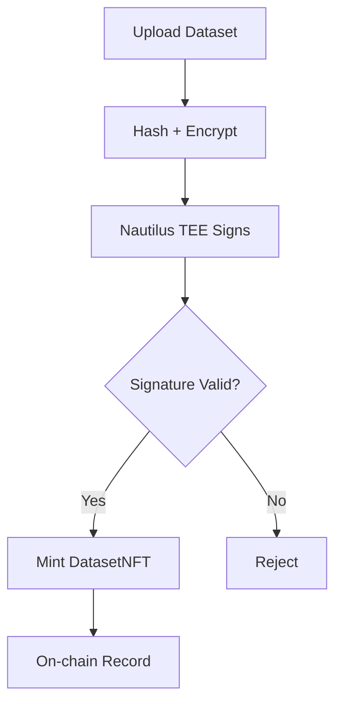
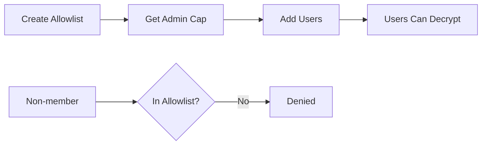

<p align="center">
  
</p>

# SealTrust Smart Contracts

Sui Move contracts for dataset verification and access control.

<p align="center">
  
  &nbsp;&nbsp;
  
  &nbsp;&nbsp;
  
</p>

---

## The Problem

Storing dataset proofs on centralized systems means:
- Records can be modified or deleted
- No cryptographic guarantees of integrity
- Access control is opaque and revocable

## The Solution

On-chain DatasetNFTs with TEE-attested verification and Seal-based access control.



---

## Contracts

| Contract | Purpose | Package ID |
|----------|---------|------------|
| `sealtrust-verification` | DatasetNFT registration with TEE attestation | `0xcdc25c90e328f2905c97c01e90424395dd7b10e67769fc8f4ae62b87f1e63e4e` |
| `seal-allowlist` | Access control for Seal decryption | `0x705937d7b0ffc7c37aa23a445ed52ae521a47adcdffa27fe965e0b73464a9925` |
| `enclave` | Nautilus enclave configuration | Dependency |

---

## sealtrust-verification

Registers datasets with cryptographic proof from Nautilus TEE.

<details>
<summary>DatasetNFT Structure</summary>

```move
public struct DatasetNFT has key, store {
    id: UID,
    original_hash: vector<u8>,      // Hash of UNENCRYPTED file
    metadata_hash: vector<u8>,
    walrus_blob_id: String,         // Walrus storage location
    seal_policy_id: String,         // Seal access policy
    seal_allowlist_id: Option<ID>,  // Who can decrypt
    name: String,
    format: String,
    size: u64,
    verification_timestamp: u64,
    enclave_id: ID,
    tee_signature: vector<u8>,      // Nautilus attestation
    owner: address,
}
```

</details>

<details>
<summary>How Seal Integration Works</summary>



The `seal_approve` function is called by Seal key servers to verify access:

```move
entry fun seal_approve(id: vector<u8>, allowlist: &Allowlist, ctx: &TxContext)
```

</details>

---

## seal-allowlist

Controls who can decrypt datasets encrypted with Seal.

<details>
<summary>Key Functions</summary>

```move
// Create allowlist (returns admin Cap)
public fun create_allowlist(name: String, ctx: &mut TxContext): Cap

// Add user (requires Cap)
public fun add(allowlist: &mut Allowlist, cap: &Cap, account: address)

// Remove user (requires Cap)
public fun remove(allowlist: &mut Allowlist, cap: &Cap, account: address)

// Check access (called by Seal)
entry fun seal_approve(id: vector<u8>, allowlist: &Allowlist, ctx: &TxContext)
```

</details>

---

## Quick Start

```bash
# Build
cd sealtrust-verification
sui move build

# Test
sui move test

# Deploy
sui client publish --gas-budget 100000000
```

---

## Deployed Addresses (Testnet - 2025-11-22)

| Object | Address | Explorer |
|--------|---------|----------|
| Verification Package | `0xcdc25c90e328f2905c97c01e90424395dd7b10e67769fc8f4ae62b87f1e63e4e` | [View](https://testnet.suivision.xyz/package/0xcdc25c90e328f2905c97c01e90424395dd7b10e67769fc8f4ae62b87f1e63e4e) |
| Allowlist Package | `0x705937d7b0ffc7c37aa23a445ed52ae521a47adcdffa27fe965e0b73464a9925` | [View](https://testnet.suivision.xyz/package/0x705937d7b0ffc7c37aa23a445ed52ae521a47adcdffa27fe965e0b73464a9925) |
| EnclaveConfig | `0x55d6a15a5e8822b39f76dc53031d83beddc1e5b0e3ef804b82e8d4bfe4fbdc32` | [View](https://testnet.suivision.xyz/object/0x55d6a15a5e8822b39f76dc53031d83beddc1e5b0e3ef804b82e8d4bfe4fbdc32) |
| Enclave | `0x611b83f2b4d97471a6c164877ff23a2f0570806baf3d9380d1f11433a2b685ec` | [View](https://testnet.suivision.xyz/object/0x611b83f2b4d97471a6c164877ff23a2f0570806baf3d9380d1f11433a2b685ec) |

---

## How We Use Sui

<details>
<summary>Registration Flow</summary>

```typescript
const tx = new Transaction();

tx.moveCall({
  target: `${PACKAGE}::sealtrust::register_dataset_dev`,
  typeArguments: [`${PACKAGE}::sealtrust::SEALTRUST`],
  arguments: [
    tx.pure.vector('u8', nameBytes),
    tx.pure.vector('u8', formatBytes),
    tx.pure.u64(size),
    tx.pure.vector('u8', originalHash),
    tx.pure.vector('u8', metadataHash),
    tx.pure.string(walrusBlobId),
    tx.pure.string(sealPolicyId),
    tx.pure.option('address', allowlistId),
    tx.pure.u64(timestamp),
    tx.pure.vector('u8', teeSignature),
    tx.object(ENCLAVE_CONFIG_ID),
  ],
});
```

</details>

---

## File Structure

```
move/
├── sealtrust-verification/
│   ├── sources/sealtrust.move    # Main contract
│   └── Move.toml
├── seal-allowlist/
│   ├── sources/allowlist.move    # Access control
│   └── Move.toml
├── enclave/
│   ├── sources/enclave.move      # Nautilus config
│   └── Move.toml
├── DEPLOYMENT.md                 # Full deployment details
└── README.md
```

---

## Deployment

For full deployment details including:
- AWS Nitro Enclave configuration
- PCR measurements
- Transaction history
- API endpoints

👉 **See [DEPLOYMENT.md](./DEPLOYMENT.md)**
