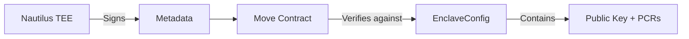

<p align="center">
  
</p>

# Enclave Configuration Contract

Nautilus package for managing TEE enclave configuration on Sui.

<p align="center">
  
  &nbsp;&nbsp;
  
  &nbsp;&nbsp;
  
</p>

---

## Purpose

Stores the public key and PCR values for Nautilus enclave verification. The Move contract uses this to verify signatures from the TEE.



---

## How We Use It

The `sealtrust-verification` contract imports this package to verify TEE signatures:

```move
use enclave::enclave::{Self, Enclave};

// Verify signature from Nautilus
let is_valid = enclave::verify_signature<T, DatasetVerification>(
    enclave,
    DATASET_INTENT,
    timestamp_ms,
    verification_data,
    tee_signature
);
```

---

## EnclaveConfig Object

Created on contract deployment:

| Field | Description |
|-------|-------------|
| `name` | Human-readable identifier |
| `pcr0` | Code measurement hash |
| `pcr1` | Kernel/boot config hash |
| `pcr2` | Application hash |

---

## Deployed

| Object | Address |
|--------|---------|
| EnclaveConfig | `0x55d6a15a5e8822b39f76dc53031d83beddc1e5b0e3ef804b82e8d4bfe4fbdc32` |

---

## Reference

- [Nautilus Documentation](https://docs.sui.io/concepts/cryptography/nautilus)
- [AWS Nitro Enclaves](https://docs.aws.amazon.com/enclaves/)
